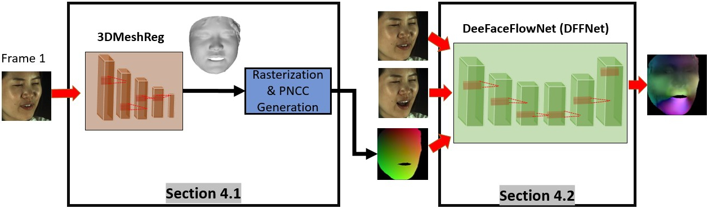

# [DeepFaceFlow: In-the-wild Dense 3D Facial Motion Estimation](https://arxiv.org/abs/2005.07298):
[](https://youtu.be/8ocEBVaEou8)
[](https://arxiv.org/abs/2005.07298)

This is the official repository of our CVPR 2020 paper DeepFaceFlow.

[Mohammad Rami Koujan](https://github.com/mrkoujan)<sup> 1,4</sup>,
[Anastasios Roussos](http://users.ics.forth.gr/~troussos/)<sup> 1,2,4</sup>,
[Stefanos Zafeiriou](https://wp.doc.ic.ac.uk/szafeiri/)<sup> 3,4</sup>
<br/>
<sup>1 </sup>University of Exeter
<br/>
<sup>2 </sup>Foundation for Research and Technology - Hellas (FORTH), Greece
<br/>
<sup>3 </sup>Imperial College London
<br/>
<sup>4 </sup>FaceSoft.io

[[Preprint]](https://arxiv.org/pdf/2005.07298.pdf)
__[CVPR 2020]__

### Abstract 


Dense 3D facial motion capture from only monocular in-the-wild pairs of RGB images is a highly challenging problem with numerous applications, ranging from facial expression recognition to facial reenactment. In this work, we propose DeepFaceFlow, a robust, fast, and highly-accurate framework for the dense estimation of 3D non-rigid facial flow between pairs of monocular images. Our DeepFaceFlow framework was trained and tested on two very large-scale facial video datasets, one of them of our own collection and annotation, with the aid of occlusion-aware and 3D-based loss function. We conduct comprehensive experiments probing different aspects of our approach and demonstrating its improved performance against state-of-the-art flow and 3D reconstruction methods. Furthermore, we incorporate our framework in a full-head state-of-the-art facial video synthesis method and demonstrate the ability of our method in better representing and capturing the facial dynamics, resulting in a highly-realistic facial video synthesis. Given registered pairs of images, our framework generates 3D flow maps at ~ 60 fps.

### Proposed Framework



Our overall designed framework is demonstrated above. We expect as input two RGB images I_1, I_2 and produce at the output an image F encoding the per-pixel 3D optical flow from I_1 to I_2. The designed framework is marked by two main stages: 1) 3DMeshReg: 3D shape initialisation and encoding of the reference frame I_1, 2) DeepFaceFlowNet (DFFNet): 3D face flow prediction. The entire framework was trained in a supervised manner, utilising the collected and annotated dataset, see our paper for more details, and fine-tuned on the 4DFAB dataset, after registering the sequence of scans coming from each video in this dataset to our 3D template. Input frames were registered to a 2D template of size 224X224 with the help of the 68 mark-up and fed to our framework.  


### Face3DVid Dataset
Details about our collected Face3Dvid dataset will be published soon.

### Citation
If you find our work useful, please cite it as follows:
```
@article{koujan2020deepfaceflow,
  title={DeepFaceFlow: In-the-wild Dense 3D Facial Motion Estimation},
  author={Koujan, Mohammad Rami and Roussos, Anastasios and Zafeiriou, Stefanos},
  journal={arXiv preprint arXiv:2005.07298},
  year={2020}
}
```
